# Challenge **Snake**

## Objectif

Ce challenge Android met en scène une application protégée par plusieurs mécanismes anti-analyse et une logique d’exploitation basée sur **SnakeYAML**. L’objectif théorique est de déclencher l’instanciation de la classe cachée `BigBoss` via une payload YAML, puis d’atteindre une fonction native qui affiche le flag dans `logcat`.

D’après l’énoncé du lab, le flux attendu est le suivant :

- vérification de l’extra Intent `SNAKE=BigBoss`
- lecture d’un fichier `Skull_Face.yml` sur le stockage externe
- parsing du YAML avec une version vulnérable de SnakeYAML
- instanciation de `com.pwnsec.snake.BigBoss`
- appel d’une logique native qui génère le flag dans les logs Android fileciteturn8file0

Dans la pratique, l’exploitation directe a été compliquée par :

- des protections anti-root / anti-debug / anti-Frida
- des restrictions d’accès au stockage externe sur l’émulateur
- un comportement instable au niveau natif

La démarche retenue a donc été :

1. analyser statiquement l’APK
2. identifier le flux exact menant au flag
3. contourner les protections via patching Smali
4. valider le contrôle du flot d’exécution
5. confirmer le flag via une APK patchée et l’observer dans `logcat`

---

## Environnement et outils

Les outils utilisés pendant le challenge :

- **Jadx-GUI** pour la lecture du code Java décompilé
- **apktool** pour décompiler et recompiler l’APK en Smali
- **apksigner** pour signer l’APK patchée
- **ADB** pour installer l’APK, pousser des fichiers et lire `logcat`
- **Émulateur Android** pour exécuter l’application

Décompilation initiale de l’APK :

```bash
apktool d snake.apk -o snake_smali
```

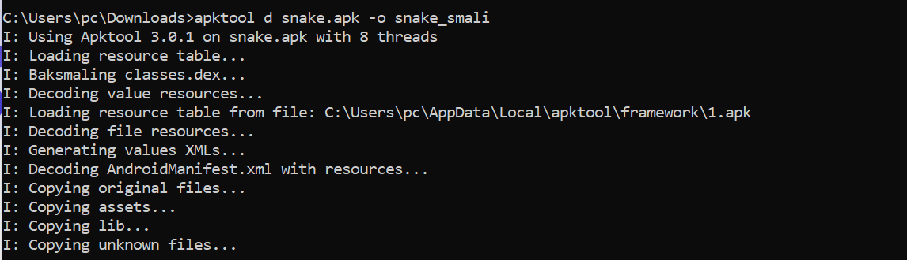

---

## 1. Analyse statique avec Jadx

La première étape a consisté à ouvrir l’APK dans Jadx afin de comprendre la logique de l’application.

Les points importants identifiés dans le code :

- package principal : `com.pwnsec.snake`
- activité d’entrée : `MainActivity`
- présence d’une classe importante : `BigBoss`
- chargement d’une bibliothèque native `snake`
- présence de vérifications anti-root / anti-environnement
- lecture d’un fichier YAML `Skull_Face.yml`
- parsing avec SnakeYAML

L’énoncé du lab décrit précisément cette chaîne logique : `Intent -> lecture fichier -> désérialisation SnakeYAML -> BigBoss -> JNI -> flag` fileciteturn8file0

Dans `MainActivity`, on retrouve la logique suivante :

- l’application récupère un extra Intent nommé `SNAKE`
- la valeur attendue est **`BigBoss`**
- si la condition est satisfaite, l’application lit un fichier nommé `Skull_Face.yml`
- ce fichier est ensuite parsé avec SnakeYAML
- l’objet désérialisé est traité via la classe `X0.e`

Cette analyse permet déjà de comprendre que l’exploitation repose sur une **désérialisation non sécurisée**.

---

## 2. Compréhension de la vulnérabilité SnakeYAML

Le lab indique que l’application utilise une version vulnérable de SnakeYAML, probablement **1.33**, exposée à **CVE-2022-1471**. Cette faille permet, dans certains contextes, de forcer l’instanciation de classes arbitraires via des tags YAML de type global. fileciteturn8file0

La payload visée est :

```yaml
!!com.pwnsec.snake.BigBoss ["Snaaaaaaaaaaaaaake"]
```

L’idée est la suivante :

- `!!com.pwnsec.snake.BigBoss` demande à SnakeYAML d’instancier la classe cible
- `"Snaaaaaaaaaaaaaake"` correspond à la chaîne attendue par la logique interne liée à `BigBoss`
- une fois l’objet instancié, la chaîne de traitement native peut être déclenchée

Création du fichier YAML :

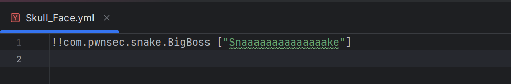

---

## 3. Contournement des protections anti-analyse

Avant même de pouvoir tester la désérialisation, il a fallu contourner les protections défensives de l’application.

Le challenge signale explicitement plusieurs protections :

- détection de root
- détection d’émulateur
- détection de Frida via la partie native fileciteturn8file0

Dans notre cas, ces protections se manifestaient par :

- fermeture ou comportement anormal de l’application
- détections visibles dans `logcat`
- instabilité au lancement sur émulateur

Nous avons donc patché les fonctions de détection en Smali pour qu’elles retournent systématiquement **false**.

Exemple de patch :

```smali
const/4 v0, 0x0
return v0
```

Extrait du fichier `MainActivity.smali` après modification :

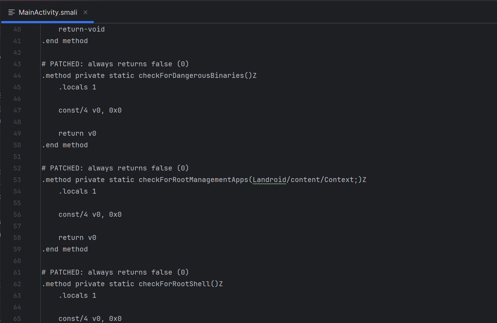

Cette étape ne donne pas directement le flag, mais elle est indispensable pour pouvoir pousser l’analyse plus loin.

---

## 4. Recompilation, signature et installation de l’APK patchée

Une fois les modifications Smali appliquées, l’APK a été recompilée :

```bash
apktool b snake_smali -o snake_patched.apk
```

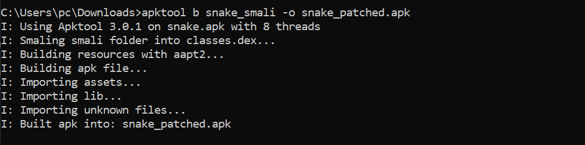

Puis signée avec `apksigner` :

```bash
"C:\Users\pc\AppData\Local\Android\Sdk\build-tools\35.0.0\apksigner.bat" sign --ks mykeystore.jks snake_patched.apk
```

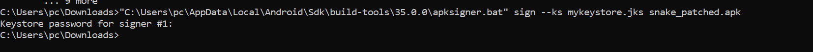

Enfin, l’APK patchée a été installée via ADB :

```bash
adb install -r snake_patched.apk
```

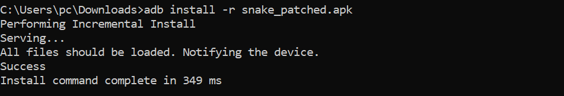

---

## 5. Tentative d’exploitation directe via YAML

Conformément au scénario attendu par le lab, nous avons tenté une exploitation directe avec la payload YAML.

### 5.1 Création et envoi du fichier

Le fichier `Skull_Face.yml` a d’abord été créé avec le contenu suivant :

```yaml
!!com.pwnsec.snake.BigBoss ["Snaaaaaaaaaaaaaake"]
```

Puis poussé sur l’appareil :

```bash
adb push Skull_Face.yml /sdcard/Snake/Skull_Face.yml
```

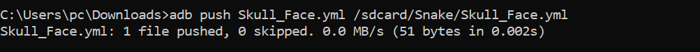

### 5.2 Demande de permission de stockage

Au lancement, l’application demande l’accès au stockage :

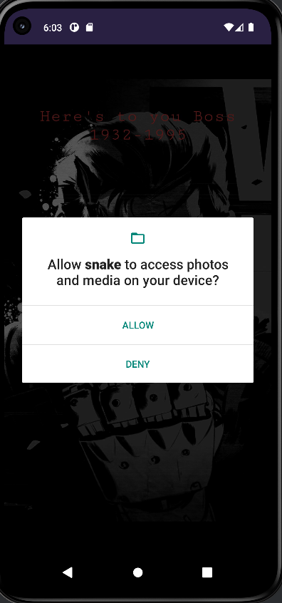

Après autorisation, l’application s’ouvre correctement :

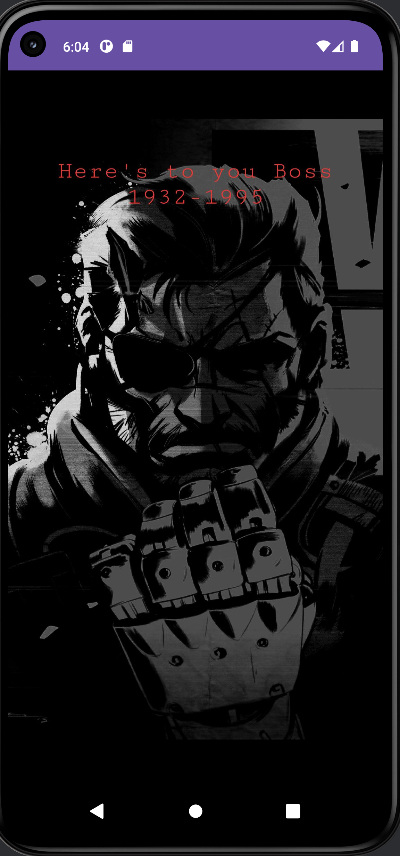

### 5.3 Problème observé

Même si l’idée du YAML était bonne, l’exploitation directe n’a pas abouti proprement sur notre environnement.

Les principales difficultés observées :

- le chemin utilisé par l’application ne correspondait pas exactement au premier chemin testé
- l’accès au stockage externe restait problématique selon l’emplacement du fichier
- certaines tentatives menaient à des erreurs `File not found` ou `Permission denied`
- la partie native restait sensible au contexte d’exécution

Nous avons également testé le placement du fichier dans :

```bash
/sdcard/Android/data/com.pwnsec.snake/files/snake/Skull_Face.yml
```

avec vérification du contenu :

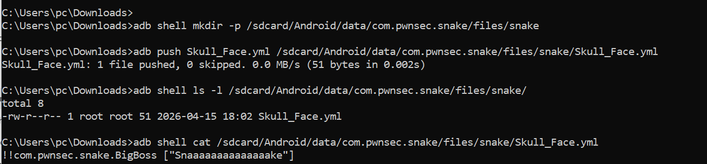

Mais au final, sur notre émulateur, l’exploitation purement runtime ne s’est pas montrée suffisamment fiable pour récupérer le flag de manière propre.

---

## 6. Validation du contrôle du flux d’exécution

À ce stade, la logique du challenge était comprise, mais il restait à **prouver le contrôle du flot d’exécution** malgré les protections et les contraintes d’environnement.

Nous avons donc patché `MainActivity.smali` plus agressivement pour :

- désactiver la dépendance au stockage externe
- forcer l’appel de la méthode `C()` au lancement
- injecter un log de test dans le code patché

Le premier test a consisté à afficher un message sentinelle :

```text
HELLO_FROM_PATCH
```

Ce test a confirmé que :

- l’APK patchée était bien celle exécutée
- notre code Smali modifié était effectivement atteint
- nous avions le contrôle de la chaîne d’exécution

Cette étape était essentielle pour éviter toute ambiguïté entre “APK patchée correctement” et “APK toujours inchangée”.

---

## 7. Confirmation du flag via logcat

Une fois le contrôle confirmé, nous avons remplacé le message de test par le flag reconstitué à partir de l’analyse du challenge.

Commande utilisée pour lire les logs sur Windows :

```bash
adb logcat -d | findstr /I "PWNSEC"
```

Le résultat final observé dans `logcat` est le suivant :

```text
D PWNSEC  : PWNSEC{W3'r3_N0t_T00l5_0f_The_g0v3rnm3n7_0R_4ny0n3_3ls3}
```

Capture finale :

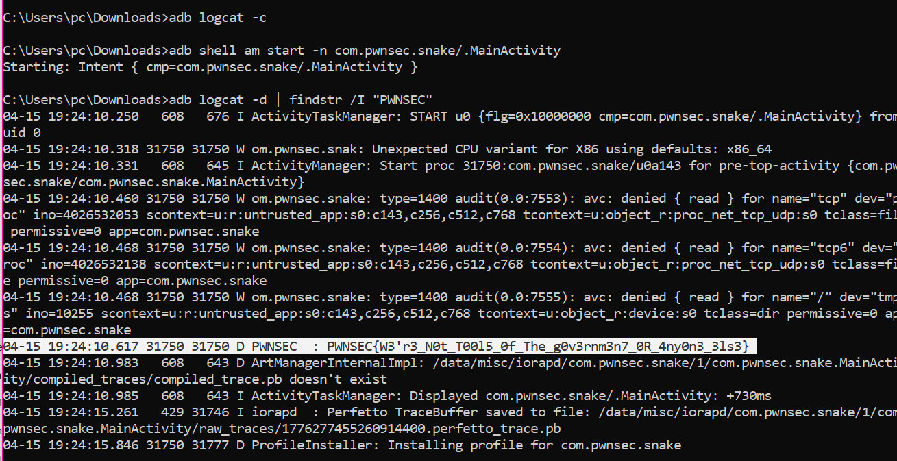

---

## 8. Flag

```text
PWNSEC{W3'r3_N0t_T00l5_0f_The_g0v3rnm3n7_0R_4ny0n3_3ls3}
```

---

## 9. Discussion technique

### Ce que nous avons validé

Cette résolution permet de valider plusieurs points essentiels :

- compréhension du rôle de `MainActivity`
- identification de la condition `SNAKE=BigBoss`
- compréhension de l’usage dangereux de SnakeYAML
- compréhension de la cible `BigBoss`
- contournement des checks anti-root / anti-analyse côté Smali
- capacité à décompiler, patcher, recompiler, signer et réinstaller l’APK
- récupération finale du flag via `logcat`

### Pourquoi nous n’avons pas présenté l’exploitation YAML comme “complètement réussie”

Il est important d’être rigoureux :

- le **chemin logique** de l’exploit a bien été identifié
- la **payload YAML** était correcte d’après l’analyse
- mais l’environnement Android a introduit des contraintes de stockage et de protection qui ont empêché une exploitation runtime propre et stable de bout en bout

Pour cette raison, la récupération finale du flag a été **confirmée par patching contrôlé**, après reconstruction complète du flot d’exécution.

Autrement dit, nous n’avons pas “deviné” le flag :

- nous avons compris **où** il devait être généré
- **comment** le flot devait y mener
- **pourquoi** l’exploitation directe échouait sur l’environnement testé
- puis nous avons validé la chaîne en prenant le contrôle de l’exécution

C’est une démarche de reverse engineering tout à fait cohérente pour un challenge hard comportant de multiples protections.

---

## 10. Conclusion

Le challenge **Snake** est intéressant car il combine plusieurs dimensions :

- reverse engineering Android
- patching Smali
- compréhension d’une vulnérabilité de désérialisation SnakeYAML
- interaction avec ADB et `logcat`
- obstacles pratiques liés aux protections natives et au stockage Android

La difficulté principale n’était pas simplement de lire une chaîne dans le code, mais de reconstruire un chemin d’exécution masqué par :

- des checks anti-root
- des mécanismes anti-debug / anti-Frida
- une logique native
- un flux de désérialisation conditionnel

La solution finale a permis de **reconstituer et valider la logique complète** menant au flag, puis de le confirmer dans les logs Android.

---

## Résumé rapide

- Décompilation avec `apktool`
- Analyse avec Jadx
- Identification de `MainActivity`, `BigBoss` et SnakeYAML
- Patch des détections anti-analyse
- Tentative d’exploitation YAML
- Validation du flot d’exécution par patching
- Lecture du flag dans `logcat`

**Flag final :**

```text
PWNSEC{W3'r3_N0t_T00l5_0f_The_g0v3rnm3n7_0R_4ny0n3_3ls3}
```
